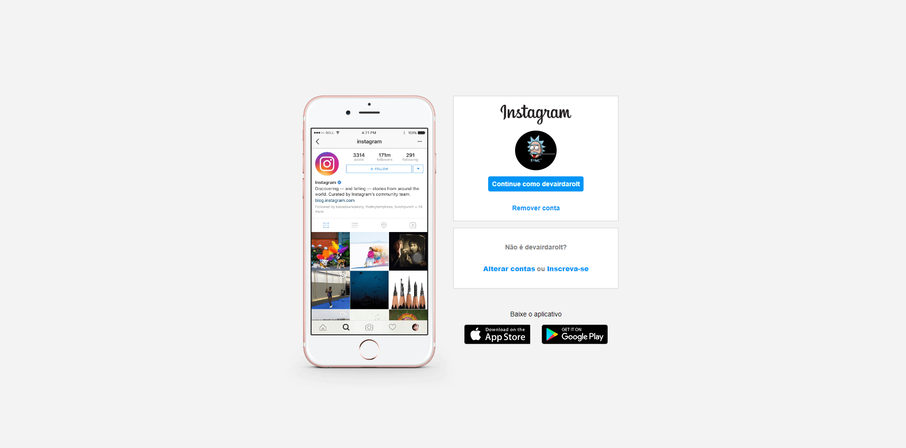

<h2>Descrição do Desafio</h2>

Nesse projeto você terá o desafio de reconstruir a página de login do Instagram. Para isso, é recomendado o uso de CSS com Flexbox, uma das abordagens de posicionamento de elementos mais utilizadas quando se trata de responsividade. Além disso, a expert disponibiliza todo o material necessário em seu GitHub para que você possa utilizá-lo como referência para a sua solução.

<h3>Tela de computador</h3>

    

<h3>Tela de celular</h3>

    

